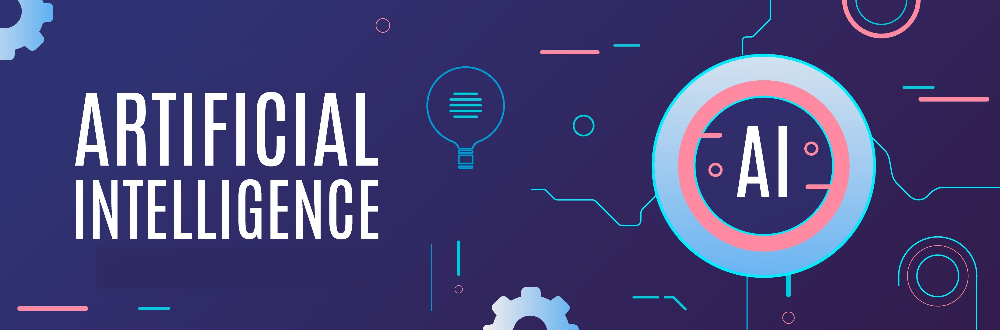

<h1 align="center">Hi, I'm Mertcan 👋</h1>

<h3 align="center">
Machine Learning Engineer · Data Scientist · Computer Vision & LLM Systems
</h3>

<p align="center">
  I build machine learning systems across forecasting, computer vision, and LLM-based workflows.
</p>

<p align="center">
  <a href="https://github.com/apheironn">
    
  </a>
  <a href="https://linkedin.com/in/mertcancatak">
    
  </a>
  <a href="https://kaggle.com/mertcancatak">
    
  </a>
</p>

---

## About Me

I am a Machine Learning Engineer and Data Scientist focused on building practical AI systems.

My work is mainly around:

- Machine learning and deep learning
- Computer vision
- LLM systems and retrieval-based applications
- Forecasting and time series modeling
- Cloud-based ML pipelines and MLOps

I am currently pursuing an M.Sc. in Data Science at Hamburg University of Technology while working on production-oriented machine learning systems.

---

## Technical Areas

```text
Machine Learning      → PyTorch, TensorFlow, Scikit-learn
LLM Systems           → RAG, Transformers, LangChain, LangGraph
Computer Vision       → OpenCV, CNNs, object detection
Forecasting           → time series, energy data, grid-based modeling
MLOps & Cloud         → Docker, Azure, AWS, CI/CD, Linux
```

---

## Tech Stack

### Languages

<p>
  
  
  
</p>

### Machine Learning & AI

<p>
  
  
  
  
  
</p>

### LLM & Data Systems

<p>
  
  
  
  
  
</p>

### Cloud, DevOps & Tools

<p>
  
  
  
  
  
</p>

---

## GitHub Activity

Most of my active development is in private repositories.  
Public contributions and selected projects are available on my profile.

---

## Connect

<p>
  <a href="https://linkedin.com/in/mertcancatak">
    
  </a>
  <a href="https://kaggle.com/mertcancatak">
    
  </a>
  <a href="https://www.leetcode.com/apheironn">
    
  </a>
</p>
